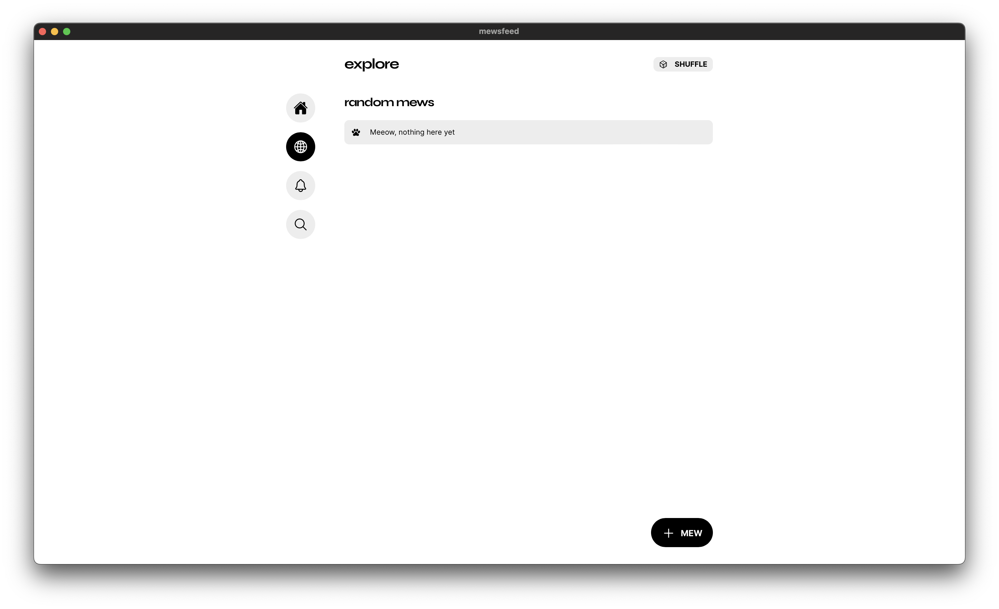
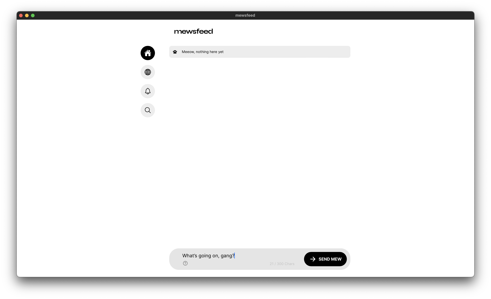
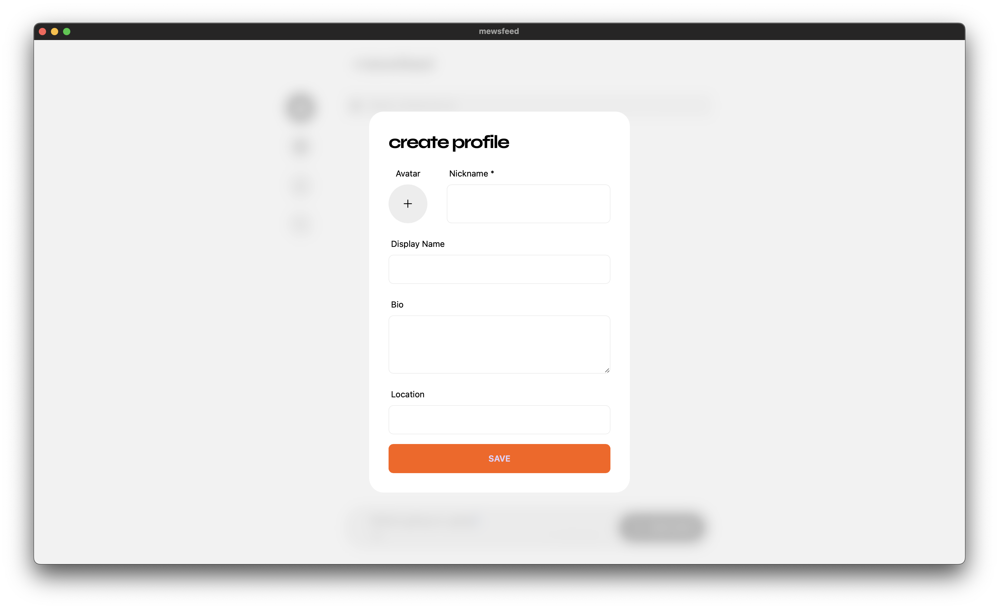
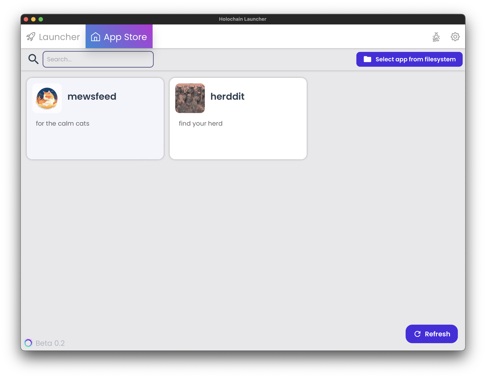
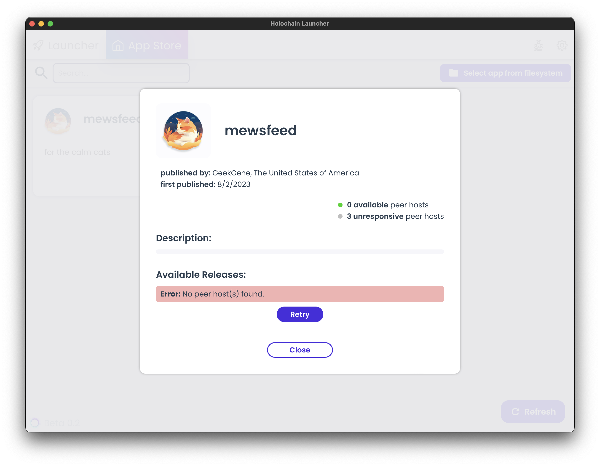
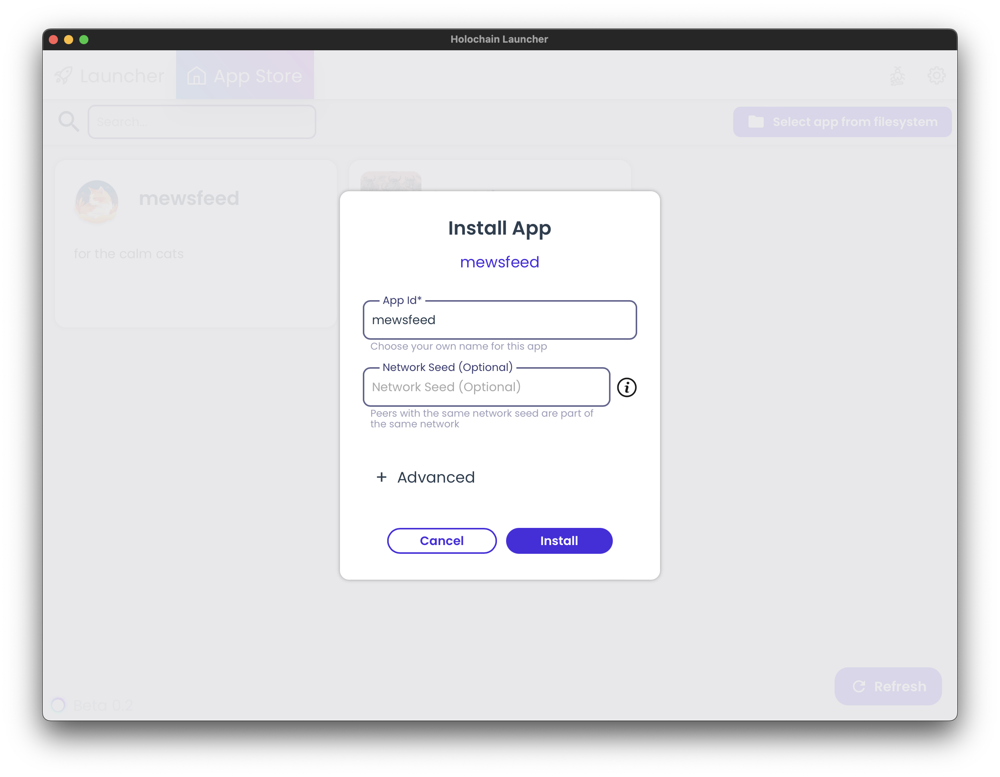

# MewsFeed – for the calm cats

MewsFeed is a micro-blogging platform built with [Holochain](https://holochain.org).

Visit [mewsfeed.social](https://mewsfeed.social) to be notified of our release!

[Collaborate on GitHub](https://github.com/orgs/GeekGene/projects/1), [join our Discord](https://discord.gg/D3BykUZumM), and donate on [OpenCollective](https://opencollective.com/mewsfeed)!

## How to use MewsFeed

MewsFeed is built with the distributed app development framework Holochain. Practically, this means that users either host themselves on their own devices or access a web version through [the Holo hosting infrastructure](https://holo.host).

Here is how to decide which version to use:

**1. You are a Tinkerer 🛠️**
You like to experiment with the tools you use and enjoy having access to the data you use.

💻 Install MewsFeed locally, either as a Desktop App with Kangaroo or in the Holochain Launcher.

This way you can analyze your data, connect it to other tools, and tinker around.

**2. You are a Creator 🧑‍💻**
You like to publish good posts and interact with your audience wherever you are.

📲 Sign up for an account on [app.mewsfeed.social](https://app.mewsfeed.social).

This way you can use it from any device through the browser.

Alternatively, install MewsFeed locally and you'll be able to create content even when you're offline.

**3. You are an Anon 👤**
You want to stay anonymous, shitpost, and interact with interesting accounts.

💻 Install MewsFeed locally, either as a Desktop App with Kangaroo or in the Holochain Launcher.

This way you have access to your posts even when you don't have internet.

**4. You are a Lurker 👀**
You mostly just want to follow others for their content and stay informed of what's happening.

📲 Sign up for an account on [app.mewsfeed.social](https://app.mewsfeed.social) and use it from any device through the browser.

Alternatively, if you only browse content from your laptop or desktop, install it locally.

Either way, you'll be able to follow people and read their stuff.

**5. You are a casual User 😎**
You like following cool accounts, interacting with your friends, and having interesting conversations.

💻 Install MewsFeed locally, either as a Desktop App with Kangaroo or in the Holochain Launcher.

This way you can access your favorite content and send replies to your friends even when you're offline.

Alternatively, sign up on [app.mewsfeed.social](https://app.mewsfeed.social) and use it from any device through the browser.

### Install as Desktop App
Download the latest release of the Desktop App here: [MewsFeed Kangaroo](https://github.com/GeekGene/mewsfeed-kangaroo/releases/tag/v0.10.1).

Once installed, you'll be greeted by the Explore page.



You have the ability to navigate around immediately (e.g. your feed).



When you try to post your first Mew (i.e. Post), you'll be prompted with the profile setup modal.



Set up your profile and start using the app!

### Install as hApp in the Holochain Launcher
Download the latest release of Holochain Launcher here: [Holochain Launcher](img/https://github.com/holochain/launcher/releases).

Install the Launcher, run it, and create a password (save it somewhere safe!). Then navigate to the hApp Store.



Install MewsFeed by clicking on it and hitting install.



If no peers are online to download it from, head to the GitHub Releases page and download [the latest .webhapp file](https://github.com/GeekGene/mewsfeed/releases)

Then click "Select from filesystem" in the Launcher and select the file from your Downloads folder.



Leave the network seed blank if you want to join the regular MewsFeed network.

(Sidenote: if you want to set up a private version of MewsFeed for your community, just add a network seed and instruct your community members to also put that same seed into the box at install time to join your network)

You'll have to go through the same profile setup steps as described in the section on installing as desktop app.

### Use the Holo-hosted Web Version
This one is the easiest option. Just head on over to [app.mewsfeed.social](https://app.mewsfeed.social), sign up for an account, fill out your profile, and start using the platform!

## Environment Setup

1. Install the holochain dev environment (only nix-shell is required): https://developer.holochain.org/docs/install/
2. Enable Holochain cachix with:

```bash
nix-env -iA cachix -f https://cachix.org/api/v1/install
cachix use holochain-ci
```

3. Clone this repo and `cd` inside of it.
4. Enter the nix shell by running this in the root folder of the repository:

```bash
nix develop
npm install
```

This will install all the needed dependencies in your local environment, including `holochain`, `hc` and `npm`.
```

## Building the DNA

- Build the DNA (assumes you are still in the nix shell for correct rust/cargo versions from step above):

```bash
npm run build:happ
```

## Running the DNA tests

```bash
npm run test
```

## UI

To test out the UI:

```bash
npm start
```

To run another agent, open another terminal, and execute again:

```bash
npm start
```

Each new agent that you create this way will get assigned its own port and get connected to the other agents.

## Package

To package the web happ:

```bash
npm run package
```

You'll have the `mewsfeed.webhapp` in `workdir`. This is what you should distribute so that the Holochain Launcher can install it.

You will also have its subcomponent `mewsfeed.happ` in the same folder`.

## Documentation

We are using this tooling:

- [NPM Workspaces](https://docs.npmjs.com/cli/v7/using-npm/workspaces/): npm v7's built-in monorepo capabilities.
- [hc](https://github.com/holochain/holochain/tree/develop/crates/hc): Holochain CLI to easily manage Holochain development instances.
- [@holochain/tryorama](https://www.npmjs.com/package/@holochain/tryorama): test framework.
- [@holochain/conductor-api](https://www.npmjs.com/package/@holochain/conductor-api): client library to connect to Holochain from the UI.
